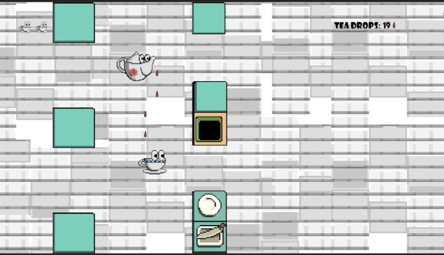

# TeaMates

## Team 
Wei Zeng - Engineer <code>wzeng@ucsd.edu</code>  
Ogulcan Buyuksandalyaci - Engineer <code>u1330176@utah.edu </code>  
Mykaela Parag - Producer <code>u1375646@umail.utah.edu</code>  
Zeshi Chen - Tech Artist <code>a18906610071@gmail.com</code>
## How to Run Source Code
Python 3+  
Dependencies: <code>pygame</code>  
Run this in your terminal: <code>py main.py </code>

## How to Run the Executable
Find main.exe in root directory, double click.